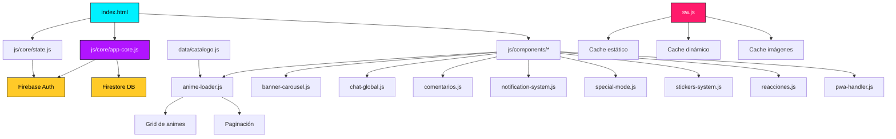

<!-- ═══════════════════════════════════════════════════════
     HEADER ONDULADO ANIMADO
═══════════════════════════════════════════════════════ -->
<div align="center">
  
</div>

<!-- ═══════════════════════════════════════════════════════
     BANNER PRINCIPAL ANIMADO
═══════════════════════════════════════════════════════ -->
<div align="center">
  
</div>

<!-- ═══════════════════════════════════════════════════════
     TÍTULO ANIMADO
═══════════════════════════════════════════════════════ -->
<div align="center">
  <a href="https://archinime.pages.dev/" target="_blank">
    
  </a>
</div>

<!-- ═══════════════════════════════════════════════════════
     BOTÓN PRINCIPAL — DEMO EN VIVO
═══════════════════════════════════════════════════════ -->
<div align="center">
  <br>
  <a href="https://archinime.pages.dev/" target="_blank">
    
  </a>
  <br><br>
</div>

<!-- ═══════════════════════════════════════════════════════
     BADGES DE ESTADO
═══════════════════════════════════════════════════════ -->
<div align="center">
  
  
  
  

  <br>

  
  
  

  <br><br>

  <a href="https://cdn.jsdelivr.net/gh/Archinime/Archivos-data@main/Nightcore%20-%20Monster%20%5BNMV%5D.mp3" target="_blank">
    
  </a>
  <br>
  <sub><i>▶️ Se abre en una nueva pestaña</i></sub>

  <br><br>

  
</div>

---

## 📑 Índice

<table align="center">
<tr>
<td align="center">🌌<br><a href="#-sobre-el-proyecto">Sobre</a></td>
<td align="center">✨<br><a href="#-características">Features</a></td>
<td align="center">🎬<br><a href="#-capturas-de-pantalla">Capturas</a></td>
<td align="center">🛠️<br><a href="#️-stack-tecnológico">Stack</a></td>
<td align="center">🏗️<br><a href="#️-arquitectura">Arqui</a></td>
</tr>
<tr>
<td align="center">📂<br><a href="#-estructura-del-proyecto">Estructura</a></td>
<td align="center">🚀<br><a href="#-instalación-local">Instalar</a></td>
<td align="center">🎮<br><a href="#-guía-de-uso">Uso</a></td>
<td align="center">🔐<br><a href="#-reglas-de-firestore">Firestore</a></td>
<td align="center">📊<br><a href="#-estadísticas">Stats</a></td>
</tr>
<tr>
<td align="center">🗺️<br><a href="#️-roadmap">Roadmap</a></td>
<td align="center">🤝<br><a href="#-contribuciones">Contribuir</a></td>
<td align="center">📄<br><a href="#-licencia">Licencia</a></td>
<td align="center">👤<br><a href="#-autor">Autor</a></td>
<td align="center">⬆️<br><a href="#">Top</a></td>
</tr>
</table>

---

<!-- ═══════════════════════════════════════════════════════
     DIVISOR ANIMADO
═══════════════════════════════════════════════════════ -->


## 🌌 Sobre el Proyecto

<div align="center">
  
</div>

**Archinime** es una plataforma de streaming de anime **independiente y auto-gestionada** con una identidad visual **cyberpunk** única. No es solo un catálogo: es un ecosistema completo con chat comunitario en tiempo real, sistema de notificaciones inteligente, votaciones, reproductor multipropósito y una experiencia de usuario que rivaliza con plataformas comerciales.

Todo está construido con **JavaScript puro + Firebase**, sin frameworks pesados, priorizando el rendimiento y la elegancia del código.

> 💡 **Filosofía del proyecto:** El anime merece una interfaz tan emocionante como las historias que reproduce.

### 🎯 ¿Por qué Archinime?

<table>
<tr>
<td width="33%" align="center">
<br>

<br><br>
<b>Diseño Único</b>
<br>
<sub>Interfaz cyberpunk con neones, partículas y efectos visuales personalizados</sub>
<br><br>
</td>
<td width="33%" align="center">
<br>

<br><br>
<b>Sin Frameworks</b>
<br>
<sub>JavaScript vanilla para máximo rendimiento y control total</sub>
<br><br>
</td>
<td width="33%" align="center">
<br>

<br><br>
<b>Comunidad Viva</b>
<br>
<sub>Chat global, reacciones y stickers personalizables</sub>
<br><br>
</td>
</tr>
<tr>
<td width="33%" align="center">
<br>

<br><br>
<b>PWA Nativa</b>
<br>
<sub>Instalable en Android/iOS como una app real</sub>
<br><br>
</td>
<td width="33%" align="center">
<br>

<br><br>
<b>Actualizaciones en Caliente</b>
<br>
<sub>Service Worker que invalida caché automáticamente</sub>
<br><br>
</td>
<td width="33%" align="center">
<br>

<br><br>
<b>Catálogo Masivo</b>
<br>
<sub>+160 animes con múltiples servidores y formatos</sub>
<br><br>
</td>
</tr>
</table>

---


## ✨ Características

### 🎬 Reproducción y Catálogo

<table>
<tr>
<td width="50%">

**📚 Catálogo**
- **163 animes** con búsqueda por nombre y alias
- Múltiples **temporadas / OVAs / Películas / Spin-Offs**
- **Filtros avanzados**: género, demografía, ranking
- **Buscador con sugerencias en vivo**
- **Paginación fluida** con efectos 3D

</td>
<td width="50%">

**📺 Reproductor**
- **Multi-servidor**: Drive, Dropbox, Catbox, Mp4Upload, PixelDrain, PlayMogo, Odysee, PeerTube, hubu.cloud
- **Marcador de episodios vistos** sincronizado
- **Navegación** anterior/siguiente
- **Descarga** con barra de progreso

</td>
</tr>
</table>

### 🎨 Interfaz y Experiencia

<table>
<tr>
<td width="50%">

**🌟 Efectos Visuales**
- Loader animado con **GIFs rotativos**
- Fondo con **video galaxia** y partículas interactivas
- **Chroma key en vivo** con canvas
- **Cursor personalizado** con glow
- **Tema de color dinámico** en el navegador

</td>
<td width="50%">

**🎭 Modos Especiales**
- **Modo especial** con video tráiler a pantalla completa
- Animaciones fluidas en todas las transiciones
- **Responsive** adaptado a móvil, tablet y escritorio
- Soporte para **prefers-reduced-motion**

</td>
</tr>
</table>

### 👤 Cuenta y Comunidad

<table>
<tr>
<td width="50%">

**🔐 Autenticación**
- **Firebase Auth**: Email/Password + Google
- **Perfil personalizable**: avatar, nombre y **color neón**
- **Presets de color** + paleta nativa personalizada
- **Cooldown de 5 días** para cambios de perfil

</td>
<td width="50%">

**💬 Social**
- **Chat global en tiempo real** con panel lateral
- **Stickers personalizables** (subida a Catbox)
- **Robo de stickers** entre usuarios
- **Reacciones tipo Facebook** en comentarios
- **Comentarios anidados** con respuestas

</td>
</tr>
</table>

### 📱 PWA y Rendimiento

<table>
<tr>
<td width="50%">

**⚡ Performance**
- Service Worker versionado (`SW_VERSION`)
- **Network-first** para HTML/JS
- **Stale-while-revalidate** para imágenes
- Precarga de recursos críticos

</td>
<td width="50%">

**📲 PWA**
- **Instalable** en Android/iOS con icono personalizado
- **Soporte offline** para recursos cacheados
- **Push notifications** preparadas
- **Detección de Brave** con banner especial

</td>
</tr>
</table>

---


## 🎬 Capturas de Pantalla

<div align="center">
  
  <br>
  <sub><i>📸 Un recorrido visual completo por la interfaz de Archinime</i></sub>
</div>

---

### 🏠 Pantalla de Inicio

<div align="center">
  <a href="https://archinime.pages.dev/" target="_blank">
    
  </a>
  <br>
  <sub>Banner carrusel · Búsqueda con sugerencias · Grid · Filtros avanzados</sub>
</div>

---

### 📚 Catálogo de Animes

<div align="center">
  
  <br>
  <sub>Grid completo · Paginación fluida · Efectos 3D al hover</sub>
</div>

---

### 📺 Reproductor de Video

<div align="center">
  
  <br>
  <sub>Multi-servidor · Comentarios · Reacciones · Descarga con progreso</sub>
</div>

---

### ⚡ Módulos Interactivos

<div align="center">
<table>
<tr>
<td width="33%" align="center">
<a href="https://cdn.jsdelivr.net/gh/Archinime/Banners@main/notificaciones.png" target="_blank">
  
</a>
<br>
<b>🔔 Notificaciones</b>
<br>
<sub>Cola de popups · Badge dinámico · Historial</sub>
</td>
<td width="33%" align="center">
<a href="https://cdn.jsdelivr.net/gh/Archinime/Banners@main/chat.png" target="_blank">
  
</a>
<br>
<b>💬 Chat Global</b>
<br>
<sub>Tiempo real · Stickers · Colores neón</sub>
</td>
<td width="33%" align="center">
<a href="https://cdn.jsdelivr.net/gh/Archinime/Banners@main/detalle.png" target="_blank">
  
</a>
<br>
<b>🎥 Detalle del Anime</b>
<br>
<sub>Votos · Temporadas · Recomendaciones</sub>
</td>
</tr>
</table>
</div>

---

### 🏠 Habitación 3D Interactiva (Lunari OS)

<div align="center">
  <a href="https://archinime.pages.dev/pages/room.html" target="_blank">
    
  </a>
</div>

> Entorno **3D inmersivo** construido con **Three.js** y modelos de **Blender**.
> Incluye controles interactivos de TV y PC, **sistema de clima sincronizado en tiempo real** según tu ubicación, e **inventario interactivo**.

---


## 🛠️ Stack Tecnológico

<div align="center">

### 🎨 Frontend
<p>


</p>

### 🔥 Backend y Datos
<p>


</p>

### 🧰 Herramientas y Servicios
<p>


</p>

### ✍️ Tipografía e Iconos
<p>


</p>

</div>

---


## 🏗️ Arquitectura

Archinime está diseñado con una **arquitectura modular** que separa responsabilidades y facilita el mantenimiento.

<div align="center">



</div>

### 🔑 Conceptos clave

<table>
<tr>
<td width="50%">

**`state.js`** → Event bus centralizado con pub/sub para sincronizar el usuario autenticado entre módulos.

</td>
<td width="50%">

**`app-core.js`** → Inicialización de Firebase, lógica de autenticación y modal de perfil.

</td>
</tr>
<tr>
<td width="50%">

**`sw.js`** → Service Worker con `SW_VERSION` editable para invalidar caché sin tocar nada más.

</td>
<td width="50%">

**`catalogo.js`** → Fuente única de verdad con 163 animes y toda la metadata.

</td>
</tr>
</table>

---


## 📂 Estructura del Proyecto

```plaintext
Archinime/
│
├── 📄 index.html                 # Página principal
├── 📄 manifest.json              # Configuración PWA
├── 📄 sw.js                      # Service Worker v107
├── 📄 robots.txt                 # SEO
├── 📄 sitemap.xml                # SEO
├── 📄 google...html              # Verificación Google Search Console
├── 📄 README.md                  # Este archivo
│
├── 📁 assets/
│   ├── 📁 gifs/                  # GIFs del loader
│   ├── 📁 img/                   # Logos, avatares, fondos
│   ├── 📁 music/                 # 14 canciones de fondo
│   └── 📁 videos/                # 11 videos para efectos
│
├── 📁 css/
│   └── 📄 styles.css             # Estilos globales
│
├── 📁 data/
│   └── 📄 catalogo.js            # Catálogo con 163 animes
│
├── 📁 js/
│   ├── 📁 components/            # Módulos visuales
│   │   ├── 📄 anime-loader.js
│   │   ├── 📄 banner-carousel.js
│   │   ├── 📄 chat-global.js
│   │   ├── 📄 comentarios.js
│   │   ├── 📄 notification-system.js
│   │   ├── 📄 pwa-handler.js
│   │   ├── 📄 reacciones.js
│   │   ├── 📄 special-mode.js
│   │   └── 📄 stickers-system.js
│   │
│   ├── 📁 core/                  # Núcleo de la app
│   │   ├── 📄 app-core.js
│   │   ├── 📄 dompurify-config.js
│   │   └── 📄 state.js
│   │
│   ├── 📁 data/
│   │   └── 📄 users-data.js
│   │
│   ├── 📁 pages/                 # Lógica de páginas internas
│   │   ├── 📄 anime-detail-core.js
│   │   └── 📄 video-player-core.js
│   │
│   └── 📁 utils/                 # Utilidades
│       ├── 📄 animaciones.js
│       ├── 📄 gifs.js
│       └── 📄 musica_fondo.js
│
└── 📁 pages/                     # Páginas HTML internas
    ├── 📄 anime-detail.html
    ├── 📄 carga.html
    ├── 📄 opciones.html
    ├── 📄 proxy.html
    └── 📄 video-player.html
```

---


## 🚀 Instalación Local

### Requisitos previos

<table>
<tr>
<td width="50%">

- 🌐 Navegador moderno (Chrome, Firefox, Edge, Safari)
- 🖥️ Servidor local (`Live Server` o `python -m http.server`)

</td>
<td width="50%">

- ⚙️ **Opcional:** Node.js (si usas `npx serve`)
- 🔑 **Opcional:** Cuenta Firebase (para tu propio backend)

</td>
</tr>
</table>

### Pasos

```bash
# 1. Clona el repositorio
git clone https://github.com/ArchinimeDev/Archinime.git
cd Archinime

# 2. Levanta un servidor local
# Opción A: con Python
python -m http.server 8000

# Opción B: con Node.js (si tienes npx)
npx serve

# Opción C: con Live Server de VS Code
# Solo abre index.html con la extensión activada
```

Luego abre **`http://localhost:8000`** en tu navegador.

> ⚠️ **Importante:** No abras `index.html` directamente con doble clic (`file://`). El Service Worker y varias funciones requieren un servidor.

---


## 🎮 Guía de Uso

### 👤 Para usuarios

<table>
<tr>
<td width="50%">

**🎯 Primeros pasos**
1. **Explora** el catálogo desde la página principal
2. **Filtra** por género, demografía o ranking
3. **Busca** por nombre o alias con sugerencias en vivo

</td>
<td width="50%">

**⚡ Cuenta y funciones**
4. **Regístrate** (email, Google) para desbloquear funciones
5. **Personaliza** tu perfil con avatar, nombre y color neón
6. **Comenta** y **reacciona** en cada episodio

</td>
</tr>
<tr>
<td width="50%">

**💬 Social**
7. **Sube stickers** y compártelos en el chat global
8. **Marca episodios** como vistos (se sincroniza)

</td>
<td width="50%">

**📱 Instalación**
9. **Instala la PWA** desde el menú del navegador
10. Disfruta de la experiencia nativa

</td>
</tr>
</table>

### 🛠️ Para desarrolladores

<details>
<summary><b>📚 Actualizar el catálogo</b></summary>

<br>

Edita `data/catalogo.js` con la estructura:

```javascript
{
  id: 123,
  title: "Nombre del Anime",
  img: "URL de portada",
  desc: "Sinopsis...",
  genres: ["Acción", "Aventura"],
  aliases: ["Nombre alternativo"],
  rating: 4.8,
  seasons: [
    {
      num: 1,
      name: "Temporada 1",
      cover: "URL de portada de temporada",
      eps: [
        {
          title: "Capítulo 1",
          link: "URL del servidor 1",
          link2: "URL del servidor 2"
        }
      ]
    }
  ],
  music: ["URL canción 1"]
}
```

</details>

<details>
<summary><b>🔄 Forzar actualización masiva del caché</b></summary>

<br>

Edita **solo** la constante en `sw.js`:

```javascript
const SW_VERSION = 'v108';  // ⬅️ Sube este número
```

Todos los usuarios recibirán la nueva versión en la siguiente carga.

</details>

<details>
<summary><b>➕ Agregar un nuevo módulo</b></summary>

<br>

1. Crea el archivo en `js/components/mi-modulo.js`
2. Impórtalo en `index.html` con `<script src="...">`
3. Registra su inicialización en `js/core/app-core.js`

</details>

---


## 🔐 Reglas de Firestore

El proyecto usa reglas **granulares** con validación de tipos, tamaños y propietarios.

### ✅ Puntos clave

<table>
<tr>
<td width="50%">

- ✅ Solo **admins** (por email) escriben en `catalogo/`
- ✅ Solo el **dueño** lee/escribe su perfil en `users/`
- ✅ Comentarios con validación de **longitud y formato**

</td>
<td width="50%">

- ✅ Votos con **transacciones atómicas** (0–5)
- ✅ Chat global con restricciones de tamaño
- ✅ Bloqueo global final (`allow read, write: if false;`)

</td>
</tr>
</table>

> 📄 Para ver las reglas completas, revisa el archivo `firestore.rules` en el repositorio.

---


## 📊 Estadísticas

<div align="center">


<br><br>


<br><br>


<br><br>


</div>

---


## 🗺️ Roadmap

<table>
<tr>
<td width="33%" align="center" valign="top">

### ✅ Completado

- [x] Autenticación (Email + Google)
- [x] Catálogo con +160 animes
- [x] Reproductor multi-servidor
- [x] Chat global con stickers
- [x] Comentarios y reacciones
- [x] Notificaciones inteligentes
- [x] Votaciones de animes
- [x] PWA instalable
- [x] Perfil personalizable
- [x] Modal de configuración
- [x] Marcador de episodios vistos

</td>
<td width="33%" align="center" valign="top">

### 🚧 En Desarrollo

- [ ] Login con GitHub principal
- [ ] Panel de administración web
- [ ] Dashboard con estadísticas
- [ ] Sistema de playlists
- [ ] Recomendaciones por historial

</td>
<td width="33%" align="center" valign="top">

### 🔮 Próximamente

- [ ] Modo offline completo
- [ ] Chromecast
- [ ] App Android (Capacitor)
- [ ] App iOS (Capacitor)
- [ ] MyAnimeList / AniList
- [ ] Subtítulos IA

</td>
</tr>
</table>

---


## 🤝 Contribuciones

¡Toda ayuda es bienvenida! Si encuentras un bug, tienes una idea o quieres mejorar el código:

<table>
<tr>
<td width="50%" valign="top">

**📝 Pasos**

1. Haz **Fork** del repositorio
2. Crea una rama descriptiva:
   ```bash
   git checkout -b feature/mi-nueva-funcionalidad
   ```
3. Haz commit con mensajes claros:
   ```bash
   git commit -m "feat: añade nueva funcionalidad X"
   ```
4. Sube los cambios:
   ```bash
   git push origin feature/mi-nueva-funcionalidad
   ```
5. Abre un **Pull Request**

</td>
<td width="50%" valign="top">

**📏 Convenciones**

- Sigue el estilo de código existente (**JS vanilla**)
- Usa nombres descriptivos en **español**
- Documenta funciones complejas
- Prueba en **desktop y móvil** antes de subir
- Mantén el rendimiento: evita dependencias pesadas
- Respeta la paleta de colores cyberpunk

</td>
</tr>
</table>

---


## 📄 Licencia

Este proyecto está bajo la licencia **MIT**. Puedes usarlo, modificarlo y distribuirlo libremente, siempre dando crédito al autor original.

Consulta el archivo [LICENSE](LICENSE) para más detalles.

---


## 👤 Autor

<div align="center">


<br><br>

### **ArchinimeDev**

*Desarrollador Full Stack · Creador independiente · Apasionado del anime*

<br>

<a href="https://www.youtube.com/@Archinime-k2g"></a>
<a href="https://github.com/ArchinimeDev"></a>
<a href="https://twitter.com/Archinime"></a>
<a href="https://discord.gg/archinime"></a>
<a href="https://www.instagram.com/archinime"></a>
<a href="mailto:archinime12@gmail.com"></a>

</div>

---

<!-- ═══════════════════════════════════════════════════════
     SECCIÓN FINAL — CTA
═══════════════════════════════════════════════════════ -->
<div align="center">

### 🚀 ¿Listo para explorar?

<br>

<a href="https://archinime.pages.dev/" target="_blank">
  
</a>

<br><br>


<br><br>


<br><br>

**⭐ Si te gusta Archinime, dale una estrella al repositorio**

**Hecho con ❤️ y mucho café ☕ por ArchinimeDev**

</div>

<!-- ═══════════════════════════════════════════════════════
     FOOTER ONDULADO ANIMADO
═══════════════════════════════════════════════════════ -->
<div align="center">
  
</div>
